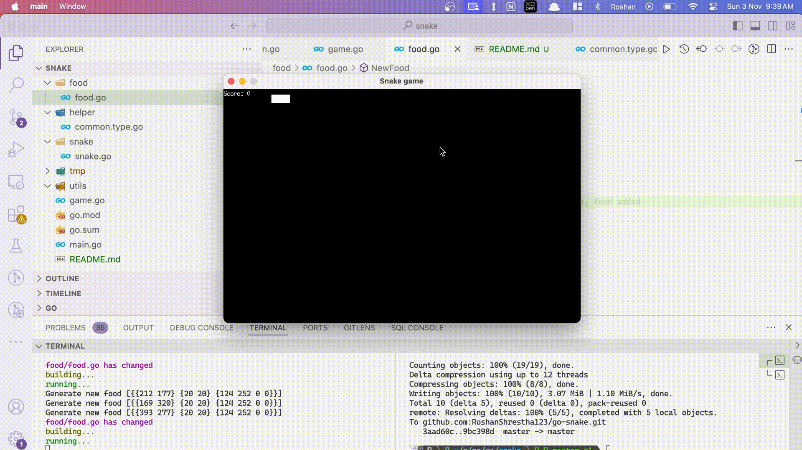

# Go Snake Game with Ebiten





This is a simple implementation of the classic Snake game using the [Ebiten game engine](https://ebitengine.org/). This project was created for experimentation and learning purposes, specifically to explore working with a graphics library in Go.

## About

- **Game Objective**: Guide the snake to eat food and grow without hitting the boundaries or itself.
- **Controls**: Use arrow keys to control the snake's direction.
- **Game Over**: The game ends if the snake collides with itself or the screen edges.

## Project Purpose

This project was built to:

- Experiment with Go’s capabilities in game development.
- Learn and practice using the Ebiten graphics library for rendering and game loops.
- Gain a foundational understanding of real-time game mechanics, such as collision detection and state management.

## How to Run

1. Install [Go](https://golang.org/dl/) and [Ebiten](https://ebitengine.org/).
2. Clone this repository:
   ```bash
   git clone https://github.com/RoshanShrestha123/go-snake.git
   cd go-snake
   ```
3. go run .
